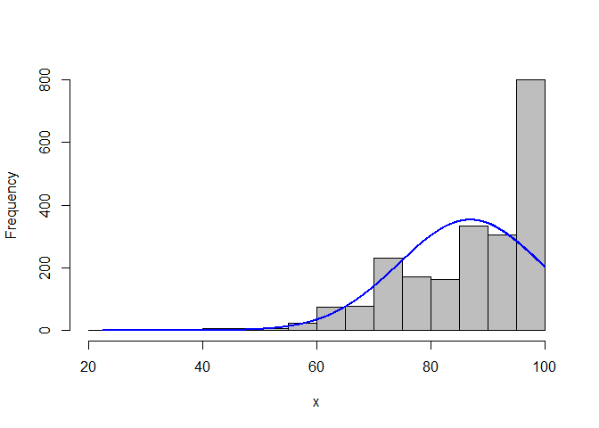
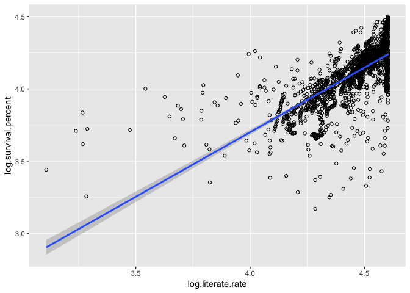
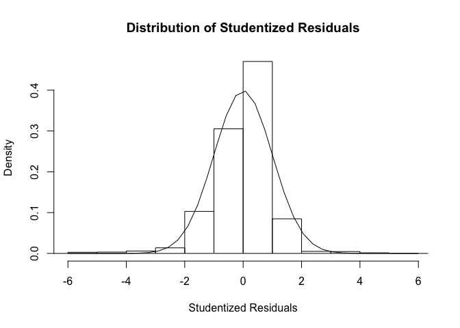
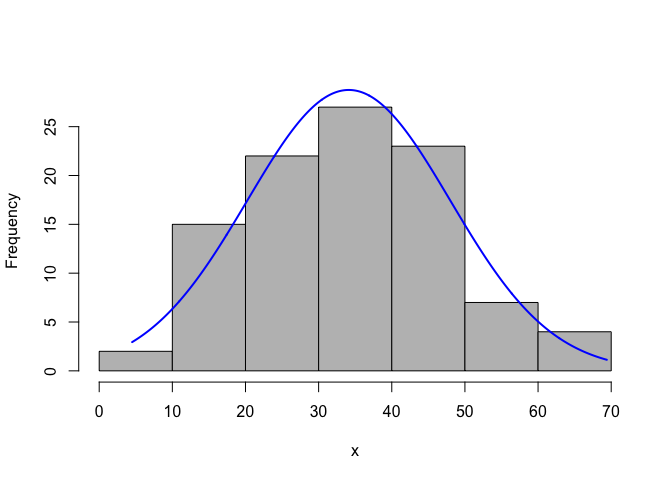
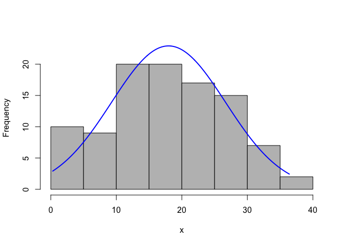
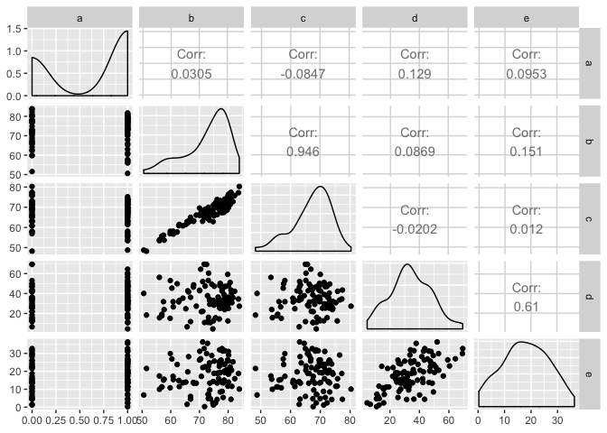
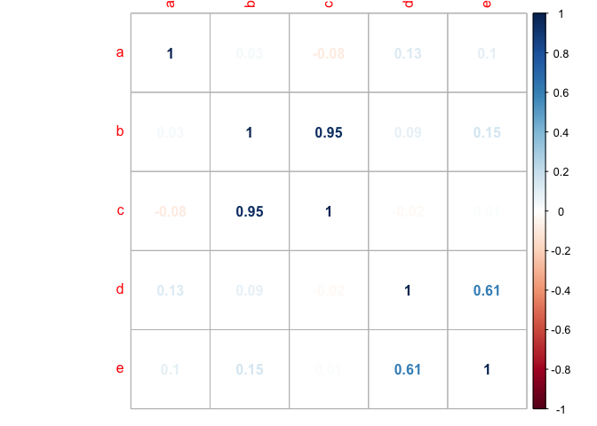

```r
library(reshape2)
library(ggplot2)
library(pander)
library(rcompanion)
library(GGally)
```

```
## 
## Attaching package: 'GGally'
```

```
## The following object is masked from 'package:pander':
## 
##     wrap
```

```r
library(corrplot)
```

```
## corrplot 0.84 loaded
```


```r
# load data from file in the data directory
data <- read.csv("./Data/API_17_DS2_en_csv_v2_10226244.csv", skip=4)
# generate rows for values for each year
data2 <- reshape(data, varying = 5:62, sep="", direction='long')
# rename columns
colnames(data2) <- c("Country","Code","Indicator","IndicatorCode","Value","Year","Id")
# isolate survival rate data into dataframe
survial.percent.male <- data2[data2$Indicator == "Survival to age 65, male (% of cohort)",]
# isolate literacy rate data into dataframe
literacy.youth.male <- data2[data2$Indicator == "Literacy rate, youth male (% of males ages 15-24)",]
# merge survival rate and literacy rate dataframes
survival.v.litrate.raw <- merge(survial.percent.male, literacy.youth.male, by=c("Code", "Year"))
# isolate specific variables from raw merged data
survival.v.literate <- survival.v.litrate.raw[c(3,1,2,6,11)]
# rename columns
colnames(survival.v.literate) <- c("Country","Code","Year","survival.percent","literate.rate")
# exclude na values
survival.v.literate <- na.omit(survival.v.literate)
# generate log of survival percent
survival.v.literate$log.survival.percent <- log(survival.v.literate$survival.percent)
# generate log of literate rate
survival.v.literate$log.literate.rate <- log(survival.v.literate$literate.rate)

summary(literacy.youth.male$Value)
```

```
##    Min. 1st Qu.  Median    Mean 3rd Qu.    Max.    NA's 
##   22.38   78.13   89.94   86.92   97.85  100.00   13099
```

```r
summary(survial.percent.male$Value)
```

```
##    Min. 1st Qu.  Median    Mean 3rd Qu.    Max.    NA's 
##   1.477  47.549  60.865  58.875  70.612  90.404    1632
```

```r
plotNormalHistogram(literacy.youth.male$Value)
```

<!-- -->

```r
plotNormalHistogram(survial.percent.male$Value)
```

<!-- -->


```r
# plot surivival rate versus literate rate
ggplot(survival.v.literate, aes(x=log.literate.rate, y=log.survival.percent)) + geom_point(shape=1) + geom_smooth(method=lm)
```

<!-- -->


```r
# generate linear model of survival rate vs literate rate
s.v.l.lm <- lm(log.survival.percent ~ log.literate.rate, data=survival.v.literate)
# generate residuals
s.v.l.m.res <- resid(s.v.l.lm)
# plot residuals
plot(survival.v.literate$log.literate.rate, s.v.l.m.res, ylab="Residuals",xlab="log.literate.rate", main="Residuals vs log of literate rate")
```

<!-- -->


```r
s.v.l.m.stud <- rstudent(s.v.l.lm)
hist(s.v.l.m.stud, freq=FALSE, main="Distribution of Studentized Residuals", xlab="Studentized Residuals")
xfit <- seq(min(s.v.l.m.stud)-1,max(s.v.l.m.stud)+1,length=40)
yfit <- dnorm(xfit)
lines(xfit,yfit)
```

<!-- -->

```r
par(mfrow=c(1,2))
qqnorm(s.v.l.m.stud)
qqline(s.v.l.m.stud)
```

<!-- -->

```r
pander(summary(s.v.l.lm))
```


--------------------------------------------------------------------
        &nbsp;           Estimate   Std. Error   t value   Pr(>|t|) 
----------------------- ---------- ------------ --------- ----------
    **(Intercept)**       0.1257     0.08567      1.467     0.1424  

 **log.literate.rate**    0.8935     0.01923      46.47       0     
--------------------------------------------------------------------


-------------------------------------------------------------
 Observations   Residual Std. Error   $R^2$   Adjusted $R^2$ 
-------------- --------------------- ------- ----------------
     2205             0.1509          0.495       0.4947     
-------------------------------------------------------------

Table: Fitting linear model: log.survival.percent ~ log.literate.rate
$\hat{\mu}(log(Survival Percent)|log(Literate Rate)) = 0.126 + 0.894 * log(Literate Rate)$

About 49.5% of the variation in the log of Survival Rate is explained by the log of the Literate Rate.


```r
mothers.postion.maternity <- data2[data2$IndicatorCode == 'SG.MMR.LEVE.EP',]

female.life.expectancy<- data2[data2$IndicatorCode == "SP.DYN.LE00.FE.IN",]

male.life.expectancy<- data2[data2$IndicatorCode =="SP.DYN.LE00.MA.IN",]

female.participation <- data2[data2$IndicatorCode =="IC.FRM.FEMO.ZS",]

female.manager <- data2[data2$IndicatorCode =="IC.FRM.FEMM.ZS",]

data3 <- Reduce(function(x,y) merge(x = x, y = y, by = c("Code", "Year")), 
       list(mothers.postion.maternity, 
            female.life.expectancy,
            male.life.expectancy,
            female.participation,
            female.manager))
```

```
## Warning in merge.data.frame(x = x, y = y, by = c("Code", "Year")): column
## names 'Country.x', 'Indicator.x', 'IndicatorCode.x', 'Value.x', 'Id.x',
## 'Country.y', 'Indicator.y', 'IndicatorCode.y', 'Value.y', 'Id.y' are
## duplicated in the result

## Warning in merge.data.frame(x = x, y = y, by = c("Code", "Year")): column
## names 'Country.x', 'Indicator.x', 'IndicatorCode.x', 'Value.x', 'Id.x',
## 'Country.y', 'Indicator.y', 'IndicatorCode.y', 'Value.y', 'Id.y' are
## duplicated in the result
```

```r
data3 <- data3[complete.cases(data3),]

names(data3)[c(6,11,16,21,26)] <- c('a','b','c','d','e')

#MULTICOLINEARITY
explanatory_variables <- data3[c(6,11,16,21,26)]

#visually 
ggpairs(explanatory_variables)
```

<!-- -->

```r
#complete data only
#correlation of each feature and another
m <- cor(explanatory_variables)

#plots correlation matrix
corrplot(m, method = c('number'))
```

<!-- -->

```r
fit <- lm(b~a+d+e, data = data3)

summary(fit)
```

```
## 
## Call:
## lm(formula = b ~ a + d + e, data = data3)
## 
## Residuals:
##     Min      1Q  Median      3Q     Max 
## -21.610  -4.052   2.612   5.651  12.380 
## 
## Coefficients:
##              Estimate Std. Error t value Pr(>|t|)    
## (Intercept) 70.277957   2.273252  30.915   <2e-16 ***
## a            0.270385   1.621061   0.167    0.868    
## d           -0.005473   0.071225  -0.077    0.939    
## e            0.137730   0.113102   1.218    0.226    
## ---
## Signif. codes:  0 '***' 0.001 '**' 0.01 '*' 0.05 '.' 0.1 ' ' 1
## 
## Residual standard error: 7.759 on 96 degrees of freedom
## Multiple R-squared:  0.02303,	Adjusted R-squared:  -0.007504 
## F-statistic: 0.7542 on 3 and 96 DF,  p-value: 0.5226
```

```r
summary(data3[c(6,11,16,21,26)])
```

```
##        a              b               c               d        
##  Min.   :0.00   Min.   :50.59   Min.   :48.25   Min.   : 4.50  
##  1st Qu.:0.00   1st Qu.:68.68   1st Qu.:63.30   1st Qu.:25.40  
##  Median :1.00   Median :74.96   Median :68.53   Median :33.10  
##  Mean   :0.63   Mean   :72.74   Mean   :67.20   Mean   :34.12  
##  3rd Qu.:1.00   3rd Qu.:78.37   3rd Qu.:71.62   3rd Qu.:43.52  
##  Max.   :1.00   Max.   :83.90   Max.   :80.30   Max.   :69.40  
##        e        
##  Min.   : 0.30  
##  1st Qu.:11.68  
##  Median :18.75  
##  Mean   :17.97  
##  3rd Qu.:24.70  
##  Max.   :36.40
```

```r
lapply(data3[c(6,11,16,21,26)], plotNormalHistogram)
```

<!-- --><!-- --><!-- --><!-- --><!-- -->

```
## $a
## NULL
## 
## $b
## NULL
## 
## $c
## NULL
## 
## $d
## NULL
## 
## $e
## NULL
```


